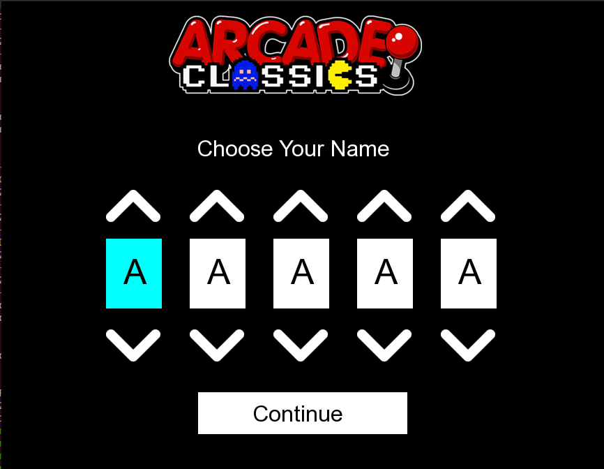

# Arcade

Arcade is a project based on Object-Oriented Programming in which you can play at clone of famous games and change game or graphic library at any time in runtime<br/>
The structure is separate in three parts (core, graphic libraries and games)<br/><br/>

The difficulty of this project is to make graphic libraries that share the same interface and same for games. That allow that someone else can create a new game or a new graphic librairy and implement it to our program to play with. 

## Usage

You'll need [make](https://www.gnu.org/software/make/) to compile the project.

```sh
$ git clone https://github.com/Nathn-G/arcade.git
$ cd arcade
$ make
```

The program must take as a startup argument the graphics library to use initially.
It must nevertheless be possible to change the graphics library at run-time.

```
$ ./arcade ./lib/arcade_sfml.so
```

## Documentation

All graphics libraries and games are in folder `./lib` after compilation.

## Views

</a>
</a>
</a>
</a>
</a>

## Other groups

For this project, we works with two other groups which we can share libraries and games thanks to our same interfaces for the the project architecture<br/><br/>

First group :<br/>
- Antonin Ricard: antonin.ricard@epitech.eu<br/>
- Théo Bori: theo1.bori@epitech.eu<br/>
- Martin Galtier: martin.galtier@epitech.eu<br/><br/>

Second group:<br/>
- Bastien Boymond: bastien.boymond@epitech.eu<br/>
- Diogo Faria-Martins: diogo.faria-martins@epitech.eu<br/>
- Hugo Marrasse: hugo.marrasse@epitech.eu<br/><br/>

Our group:<br/>
- Mathis Lorenzo: mathis.lorenzo@epitech.eu<br/>
- Maya Hill: maya.hill@epitech.eu<br/>
- Nathan Guiu: nathan.guiu@epitech.eu<br/>
